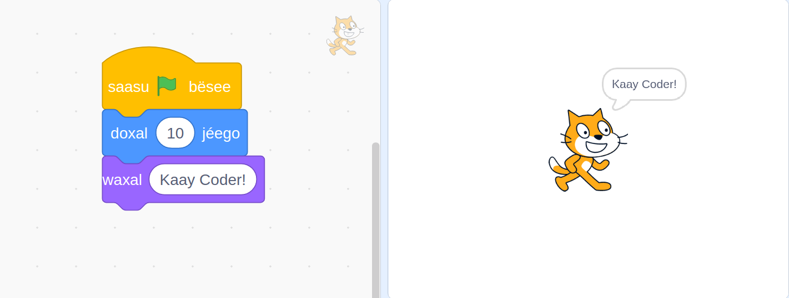

# Scratch-si-wolof
Traduire Scratch en Wolof



## Rejoindre l'équipe
Vous avez une bonne maîtrise de scratch et du Wolof, parler Anglais ou Français. Rejoignez-nous

<ol>
    <li>Inscrivez-vous ici https://www.transifex.com/</li>
    <li>Rejoignez l’équipe Scratch</li>
    <li>Rejoindre la traduction en wolof</li>
</ol>

## Traduction

### En ligne
Vous pouvez traduire en ligne sur [transifex.com](https://www.transifex.com/)

### Locale
Avec l'aide Transifex CLI vous pouvez traduire en locale.

**Installation Transifex CLI**

Sous linux tapez la commande suivante

```
sudo apt install transifex-client
````

**Récupérer le projet**

Tapez cette commande

```
git clone https://github.com/KaayCoder/Scratch-si-wolof.git
cd Scratch-si-wolof
```
**Initialisation projet**

Vous avez besoin d'un Token, allez à [https://www.transifex.com/user/settings/api/](https://www.transifex.com/user/settings/api/) pour vous générer un clé.

Enregistrez votre Token en local avec la commande suivante. Remplacer <votre_token_Transifex> par votre clé générée

```
echo TX_TOKEN=<votre_token_Transifex> > .env
```

Tapez la commande suivante pour l'initialisation de votre projet

```
npm run init
```

Pas besoin d'entrer le chemin local, tapez **ctrl-z** pour sortir

**Configuration projet**

tapez la commande suivante

```
npm run config
```

**Téléchargez Traduction depuis Transifex**

Avec la commande suivante vous allez télécharger la traduction en Wolof

```
npm run pull
```

La traduction est dans le dossier **translations**. Bonne traduction ;-)


**Proposez votre traduction sur github**
```
npm run propose
```

**Récuperez une traduction sur github**
```
npm run recover
```

**Envoyer votre traduction sur Transifex**

```
npm run push
```


## Document de Référence
Nous recommandons les documents suivant pour vous aidr dans l'écriture de la langue wolof

* [Dictionnaire wolof-français et français-wolof](https://books.google.sn/books?id=gJ8YBgAAQBAJ&hl=fr)
* [Dictionnaire français-wolof et français-bambara, suivi du dictionnaire wolof-français](https://books.google.sn/books?id=HqoFAAAAQAAJ&hl=fr)

## Contribuer

Lisez s'il vous plait [CONTRIBUTING.md](CONTRIBUTING.md) pour plus de détails sur notre code de conduite et le processus de soumission des demandes de contribution.

## contributeurs

* [Thierno DIOP](https://github.com/geekdiop)
* [Akhmadou Ndiaye](https://github.com/0SansNom)
* Votant des sondages sur le compte twitter [@kaaycoder](https://twitter.com/kaaycoder)

## Auteurs

* **Mamadou Diagne** - [Genova](https://github.com/genova)

## Licence

Ce projet est sous licence MIT - voir le fichier [LICENSE](LICENSE) pour plus de détails.
