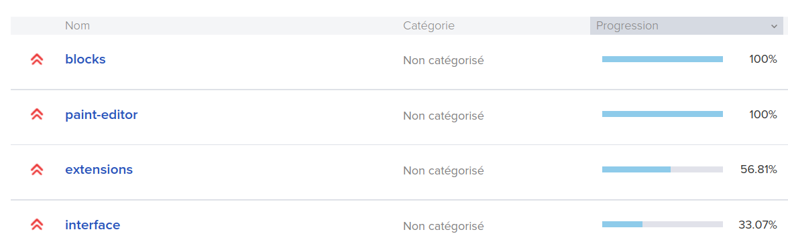

# Scratch Si Wolof

Traduire [Scratch](https://scratch.mit.edu) en [Wolof](https://fr.wikipedia.org/wiki/Wolof_(langue))


## Projets (5)

- Scratch Editor 
- Scratch 3.0 Videos 
- Scratch Coding resources 
- Scratch Website 
- Scratch Website (Legacy) 

## Projet Scratch Editor



## Rejoindre l'équipe

Vous avez une bonne maîtrise de scratch et du Wolof, parler Anglais ou Français. Rejoignez-nous

1. Inscrivez-vous ici <https://www.transifex.com>
2. Rejoignez l’équipe [Scratch](https://www.transifex.com/llk/scratch-editor/dashboard/)
3. [Rejoindre la traduction en wolof](https://www.transifex.com/llk/teams/60938/wo/)

### Discuter avec l'équipe

- [Kaay Waxtan!](https://github.com/KaayCoder/Scratch-si-wolof/discussions)
- Nous sommes sur [Telegram](https://t.me/+EyZVh0dPsSfhdVwm) n'hésitez pas à venir discuter avec les membres de l'équipe.

## Document de Référence

Nous recommandons les documents suivant pour vous aidr dans l'écriture de la langue wolof

- [Dictionnaire wolof-français et français-wolof](https://books.google.sn/books?id=gJ8YBgAAQBAJ&hl=fr)
- [Dictionnaire français-wolof et français-bambara, suivi du dictionnaire wolof-français](https://books.google.sn/books?id=HqoFAAAAQAAJ&hl=fr)

## Traduction

### En ligne

Nous vous recommandons de traduire en ligne sur [transifex.com](https://www.transifex.com/)

### Locale

Avec l'aide [Transifex CLI](https://docs.transifex.com/client/introduction), vous pouvez traduire en locale, mais cette méthode n'est pas la plus simple.

**Installation Transifex CLI**

Sous linux tapez la commande suivante

```
sudo apt install transifex-client
````

**Récupérer le projet**

Tapez cette commande

```
git clone https://github.com/KaayCoder/Scratch-si-wolof.git
cd Scratch-si-wolof
```

**Initialisation projet**

Vous avez besoin d'un Token, allez à [https://www.transifex.com/user/settings/api/](https://www.transifex.com/user/settings/api/) pour vous générer un clé.

Enregistrez votre Token en local avec la commande suivante. Remplacer <votre_token_Transifex> par votre clé générée

```
echo TX_TOKEN=<votre_token_Transifex> > .env
```

Tapez la commande suivante pour l'initialisation de votre projet

```
npm run init
```

Pas besoin d'entrer le chemin local, tapez **ctrl-z** pour sortir

**Configuration projet**

tapez la commande suivante

```
npm run config
```

**Téléchargez Traduction depuis Transifex**

Avec la commande suivante vous allez télécharger la traduction en Wolof

```
npm run pull
```

La traduction est dans le dossier **translations**. Bonne traduction ;-)

**Proposez votre traduction sur github**

```
npm run propose
```

**Récuperez une traduction sur github**

```
npm run recover
```

**Envoyer votre traduction sur Transifex**

```
npm run push
```

## Contribuer

Lisez s'il vous plait [CONTRIBUTING.md](CONTRIBUTING.md) pour plus de détails sur notre code de conduite et le processus de soumission des demandes de contribution.

## Contributeurs

Votant des sondages sur le compte twitter - [@kaaycoder](https://twitter.com/kaaycoder)

### Traducteurs (6)

- [Akhmadou Ndiaye](https://github.com/0SansNom) - [0SansNom](https://www.transifex.com/user/profile/0SansNom/)

- Moussa TAMBA - [djirotechno](https://www.transifex.com/user/profile/djirotechno/)

- [Thierno DIOP](https://github.com/geekdiop) - [g33kdiop](https://www.transifex.com/user/profile/g33kdiop/)

- Ousmane Thiam - [ouzigzag](https://www.transifex.com/user/profile/ouzigzag/)

- Papa Sega Wade - [papasega](https://www.transifex.com/user/profile/papasega/)

- Ousseynou Diop - [xarala221](https://www.transifex.com/user/profile/papasega/)

### Réviseur (1)

- [Mamadou Diagne](https://github.com/genova) - [Genova](https://www.transifex.com/user/profile/genova/)

## Licence

Ce projet est sous licence MIT - voir le fichier [LICENSE](LICENSE) pour plus de détails.
